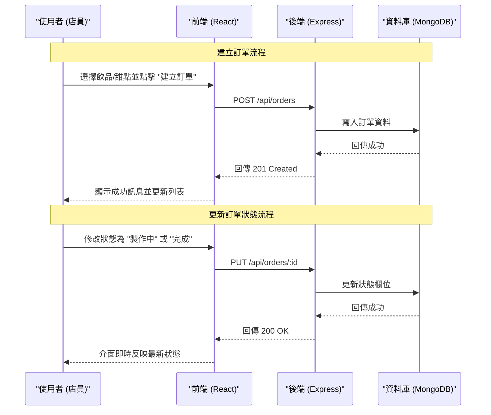

# 咖啡廳管理系統 (Coffee Shop Management System)

這是一個全端咖啡廳管理系統，專為管理菜單品項與顧客訂單而設計。本專案使用現代化全端技術堆疊構建，並支援 Docker 容器化快速部署。

## 📖 目錄
- [系統架構](#系統架構)
- [業務流程圖](#業務流程圖)
- [安裝與啟動](#安裝與啟動)
- [專案結構](#專案結構)
- [API 規格說明](#api-規格說明)
- [功能展示](#功能展示)
- [Git 提交紀錄](#git-提交紀錄)

## 🏗 系統架構

本系統採用微服務架構設計，分為前端、後端與資料庫三個獨立容器：

```
graph TD
    Client["使用者瀏覽器 / React App"]

    subgraph "Docker 容器環境"
        Frontend["前端服務 (Vite) :5173"]
        Backend["後端 API (Express) :3000"]
        DB["MongoDB 資料庫 :27017"]
    end

    Client -->|HTTP 請求 / 介面互動| Frontend
    Client -->|API 請求 (Fetch)| Backend
    Backend -->|Mongoose 連線| DB
```

- **Frontend**: 使用 React + Vite 構建，負責 UI 展示與使用者交互。
- **Backend**: 使用 Node.js + Express，提供 RESTful API。
- **Database**: 使用 MongoDB，透過 Docker Volume 確保資料持久化。

## 🔄 業務流程圖

### 訂單建立與狀態更新流程


## 🚀 安裝與啟動

### 前置需求
- 請確保您的電腦已安裝 **Docker Desktop**。

### 一鍵啟動
請在專案根目錄 (`cafe_manager`) 執行以下指令：

```bash
docker-compose up -d --build
```

### 存取服務
啟動成功後，您可以透過瀏覽器訪問：
- **前端頁面 (操作介面)**: [http://localhost:5173](http://localhost:5173)
- **後端 API 測試**: [http://localhost:3000/health](http://localhost:3000/health)

> **注意**: 為了避免與本地端 MongoDB 衝突，本專案 Docker 中的 MongoDB 對外映射到 **Port 27018**。

### 停止服務
若要結束執行並移除容器：
```bash
docker-compose down
```

## 📂 專案結構
```
cafe_manager/
├── backend/        # Express API 伺服器
│   ├── src/
│   │   ├── controllers/  # 商業邏輯
│   │   ├── models/       # 資料庫模型 (Schema)
│   │   ├── routes/       # API 路由定義
│   │   └── server.js     # 伺服器入口
├── frontend/       # React 前端應用
│   ├── src/
│   │   ├── components/   # React 元件 (MenuManager, OrderManager)
│   │   ├── api.js        # API 呼叫封裝
│   │   └── App.jsx       # 主程式入口
├── docs/           # 詳細文檔
└── docker-compose.yml # 容器編排設定
```

## 🔌 API 規格說明

所有 API 的 Base URL 為：`http://localhost:3000/api`

### 回應格式 (Response Format)
**成功 (Success)**:
```json
{
  "success": true,
  "data": { ... },
  "message": "OK"
}
```

**失敗 (Error)**:
```json
{
  "success": false,
  "error": {
    "code": "ERROR_CODE",
    "message": "錯誤訊息描述"
  }
}
```

### 1. 菜單管理 (Menu Items)

| 方法 | 路徑 | 描述 | Request Body 範例 |
|------|------|------|-------------------|
| **GET** | `/menu-items` | 取得所有品項 | - |
| **POST** | `/menu-items` | 新增品項 | `{"name": "拿鐵", "price": 120, "category": "coffee"}` |
| **PUT** | `/menu-items/:id` | 修改品項 | `{"price": 130}` |
| **DELETE** | `/menu-items/:id` | 刪除品項 | - |

### 2. 訂單管理 (Orders)

| 方法 | 路徑 | 描述 | Request Body 範例 |
|------|------|------|-------------------|
| **GET** | `/orders` | 取得所有訂單 | - |
| **POST** | `/orders` | 建立新訂單 | `{"customerName": "小明", "items": [...]}` |
| **PUT** | `/orders/:id` | 更新狀態 | `{"status": "done"}` |
| **DELETE** | `/orders/:id` | 刪除訂單 | - |

## 🎬 功能展示

1. **菜單管理**: 支援完整的 CRUD，可設定品項名稱、價格、類別與供應狀態。
2. **訂單建立**: 點選菜單品項加入購物車，自動計算總金額。
3. **交易紀錄**: 即時查看所有訂單，並可更改製作狀態 (Pending -> Making -> Done -> Cancelled)。

## 📝 Git 提交紀錄 (Commit History)

本專案開發過程中的完整 Git 提交紀錄如下：


